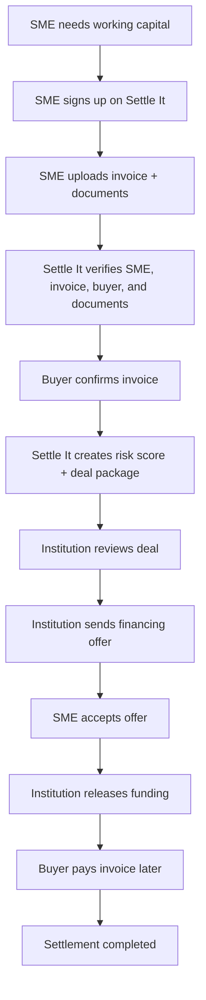
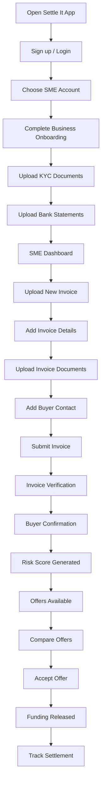
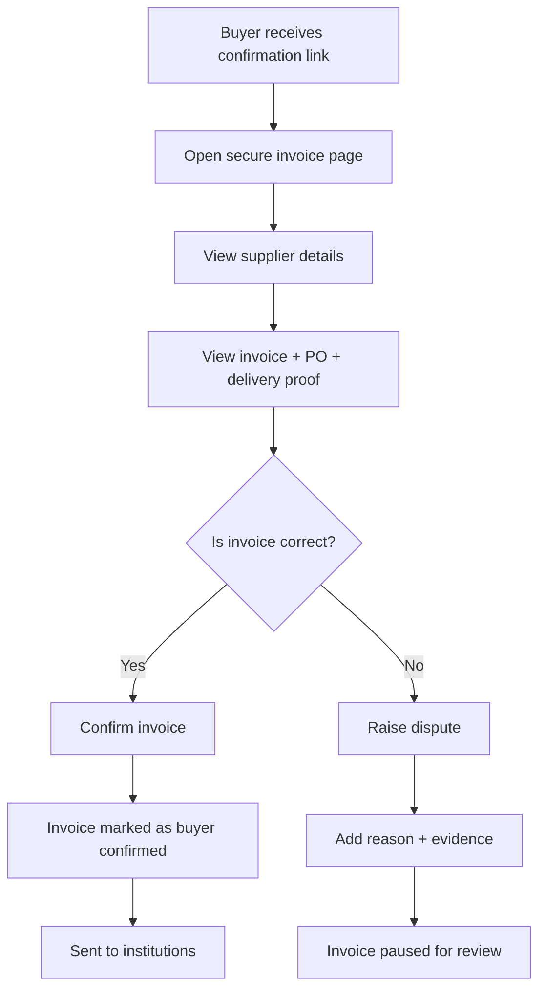
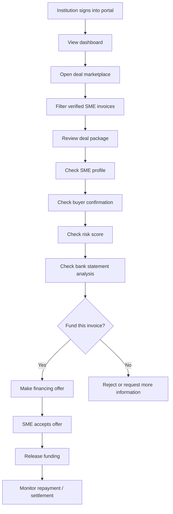
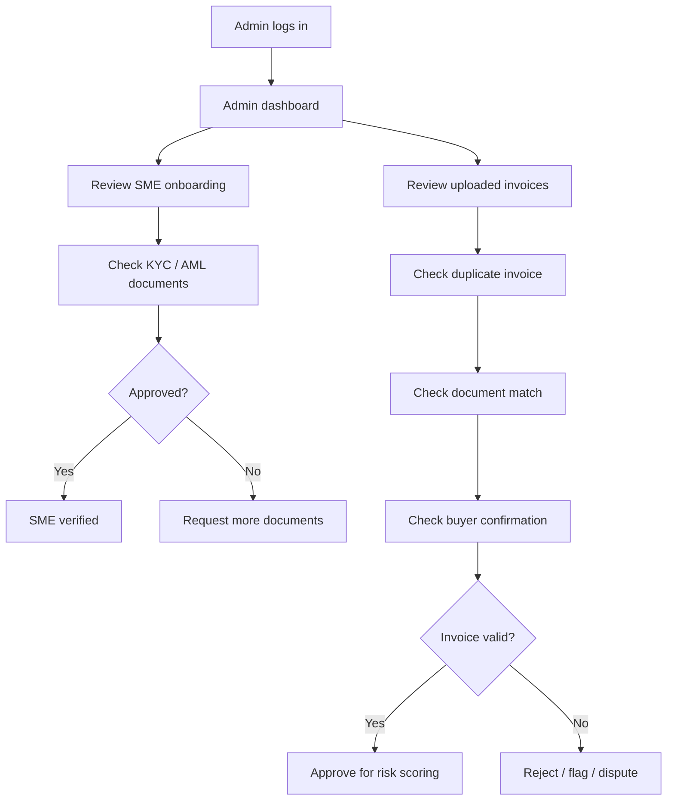
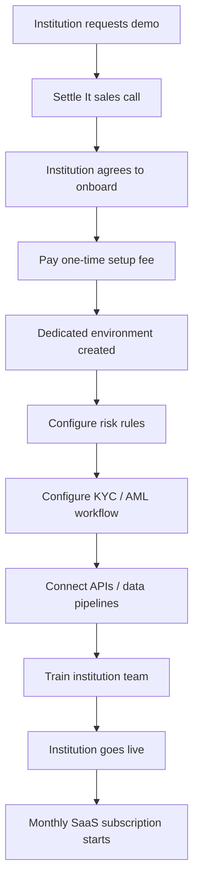
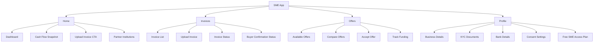
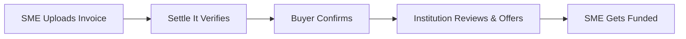

# Settle It — User Flow Diagrams

**Tagline:** Get paid before your customer pays.

Settle It is a compliance-first B2B SaaS + marketplace enabler that connects Sri Lankan SMEs with factoring institutions, NBFCs, private credit funds, and fintech lenders.

This page contains the main user-flow diagrams for the Settle It platform.

## 1. Overall Platform Flow

## 2. SME User Flow

## 3. Buyer Confirmation Flow

## 4. Institution / Lender Flow

## 5. Admin / Compliance Flow

## 6. Institution SaaS Setup Flow

## 7. SME App Footer Flow

## 8. Simple Pitch Slide Flow

